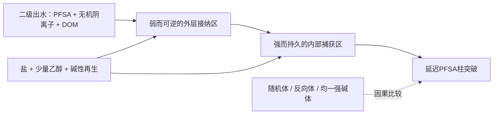

# PFHxS仿生吸附材料深度设计与准入报告

日期：2026-07-19。

## 一、最终判断

这轮没有得到一套现在就应当交给实验人员做PFHxS吸附性能验证的高质量仿生主方案。

最接近可继续验证的是`PFH-1：弱碱外层—强碱内核径向分区珠`。它的工程实体便宜、可装柱、没有蛋白/肽/二维材料和含氟功能单体；但最重要的仿生因果尚未成立。当前只能把它称为“生物转运启发的顺序分区工程假说”，不能称为主动转运仿生材料，也不能承诺比商业PFAS树脂更好。

因此本报告给出的是一套完整的**分阶段设计与否决方案**：先验证材料空间结构能否做出来，再验证空间顺序是否产生超出交换容量和孔扩散的PFSA增量，最后才进入二级出水固定床。只要前一层失败，路线就停止。这比直接合成后只看去除率更符合本项目以仿生为主要创新点的要求。

## 二、为什么选择PFHxS以及怎样定义目标

PFHxS是持久性PFSA，在市政污水相关研究中高频出现，适合作为分析主目标；工程上不要求它优先于PFBS和PFOS，因为这三类PFSA都需要去除。真正的选择性要求是：在硫酸盐、磷酸盐、氯离子、碳酸氢盐、DOM、阴离子表面活性剂和其他微污染物存在时，PFSA类仍优先富集或更晚突破。

这种定义避免了两个问题：一是为了“PFHxS特异性”设计昂贵、脆弱的分子印迹或蛋白结构；二是只在超纯水中用高投加量得到漂亮去除率，却无法进入二沉池出水。

## 三、仿生故事能讲到哪里

### 3.1 已有直接生物证据

PFHxS/PFSA可以进入磷脂双层、脂质体和细菌界面，富集总体随全氟链长度增强，PFSA通常强于相近PFCA。相关证据包括[中子反射研究](https://doi.org/10.1016/j.jcis.2017.09.102)、[脂质体与细菌研究](https://doi.org/10.1021/acs.est.8b02912)和[PFHxS-磷脂膜作用研究](https://doi.org/10.1021/acsomega.8b02448)。有机阴离子转运体还可直接运输PFBS、PFHxS和PFOS，[但不同转运体的证据范围不同](https://doi.org/10.1093/toxsci/kfw236)。

这些研究证明了两件事：PFSA会在真实生物界面经历水相接近、界面接纳和内部富集；串联空间组织可能影响最终行为。

它们没有证明三件事：自然界进化出了专门清除PFHxS的系统；磷脂正电头基是PFSA专属位点；被动树脂可以复制耗能转运蛋白的方向性和构象循环。

### 3.2 PFH-1的合法转译

PFH-1只提取一个可删除的组织原则：

外层不是“蛋白受体”，而是人工构造的可质子化叔胺区；内核是普通永久季铵阴离子交换区。创新若成立，不在于发现了新官能团，而在于同样的官能团总量按传质顺序排列后，是否同时改善真实水竞争、传质和再生。

### 3.3 为什么另外两条路线停止

- 非氟化有序C18界面珠无法证明湿态交联网络中存在稳定、可比较的膜样有序界面；全氟链也未必偏爱致密烃链晶区。
- 负电筛分壳会先排斥PFSA，且没有直接生物证据证明它能让PFSA穿过而挡住无机阴离子和DOM。
- 固定正电头＋长烃链季铵树脂是合理化学，但不是被生物证据支持的功能仿生。已有研究已经报告疏水取代基提高PFAS亲和、同时减慢传质和恶化再生，[见Schuricht等](https://doi.org/10.1016/j.jes.2016.06.011)、[Zaggia等](https://doi.org/10.1016/j.watres.2015.12.039)及[Water Research X对比](https://doi.org/10.1016/j.wroa.2022.100159)。

## 四、材料结构与合成路线

### 4.1 最终设想

- 形态：0.60–1.00 mm大孔PS-DVB球形珠，可直接回收和装填固定床。
- 外层：30–80 μm、以N-甲基乙醇胺引入的叔胺区；在中性水中部分质子化，在碱性再生时降低电荷。
- 内核：三甲胺季铵化的永久强碱区。
- 不使用：蛋白、肽、抗体、含氟功能单体、贵金属、二维材料、复杂大环主体。
- 优先制造：商品氯甲基化大孔PS-DVB珠经过两次简单胺化；若商品原料批间可控，后续再评估由St/VBC/DVB悬浮聚合自制是否真正降低成本。

### 4.2 为什么先用商品氯甲基珠

若第一轮同时自制珠、形成径向层并比较吸附，粒径、孔容、交联度和残余单体会把空间效应完全混在一起。先用同一批商品基珠不是最终成本妥协，而是缩短因果验证。只有空间顺序确有价值，才值得把基珠生产纳入放大优化。

### 4.3 合成和质量控制

完整计量、捕酸、洗涤、反向体和随机体制造方法见`rounds/pfhxs_design_1/PFH1_M0_PROTOCOL.md`。核心反应为：

1. 在低溶胀状态下，以有限量N-甲基乙醇胺和K2CO3短时处理外层苄氯位点。
2. 清洗后以过量三甲胺处理内部剩余苄氯，形成永久季铵内核。
3. 用截面微区XPS、经标准校准的ToF-SIMS/独立分层滴定、湿态IEC、孔体积和有效扩散系数确认结构。

关键不是“完成了两步反应”，而是四种空间拓扑能在相同总IEC、弱/强比例和湿态孔结构下被制造出来。若做不到，论文所需因果链就不存在。

## 五、完整因果对应

| 生物观察 | 材料实现 | 预期功能 | 直接测量 | 关键否决对照 |
|---|---|---|---|---|
| 阴离子先接近并暂时进入生物界面 | 可质子化叔胺外层 | 减少入口永久占位，提供可逆接纳 | 径向胺态、早期PFSA空间分布 | 无弱碱层的均一强碱体 |
| PFSA进入界面后继续向内部富集/运输 | 永久季铵内核 | 形成较长滞留和延迟突破 | 分时径向质量、柱突破 | 同组成随机体 |
| 功能依赖空间顺序 | 弱外/强内拓扑 | 平衡进入、捕获和再生 | 反应—扩散模型中的空间顺序项 | 强外/弱内反向体 |
| 环境变化可促进释放 | 外层在碱性下降低质子化，内核用盐醇解吸 | 降低DOM残留并恢复床层 | 解吸率、下一周期突破、质量闭合 | 均一强碱体与商业PFAS树脂 |

第一、二行是生物启发；第三、四行是材料假说。不能在实验前把后两行写成生物事实。

## 六、实验验证顺序

### M0：先证明材料和对照存在

不接触PFAS。三批制造完整体、均一体、随机体和反向体；达到外层厚度、径向富集、IEC、孔结构和粒径匹配门槛。详细标准见M0文件。失败即终止。

### E1-A：高浓度空间迁移机制

M0通过后才开展。采用足以支持分层LC-MS/MS质量定量、但低于聚集/溶解度异常区间的PFHxS浓度做5、30、120 min径向切层；每个时间点独立牺牲珠样，质量回收90–110%。浓度在方法开发后冻结，不能事后选择最漂亮条件。

同时比较PFBS/PFHxS/PFOS、PFOA、十二烷基磺酸盐。PFSA类可以共同被去除；但若十二烷基磺酸盐得到同样空间增量，说明只是普通烃类疏水/离子交换，仿生机制失败。

### E1-B：真实竞争下的批量与短柱否决

- 基础水：pH 6、7、8；NaCl、硫酸盐、磷酸盐、碳酸氢盐；DOC 2、5、10 mg C/L。
- 污染物：PFBS/PFHxS/PFOS为目标类；PFOA/PFNA/HFPO-DA为PFCA边界；十二烷基磺酸盐、磺胺甲噁唑、双酚A或另一中性有机物为非目标竞争。
- 痕量层：50–500 ng/L；方法开发层：5–10 μg/L。不得用高浓度结果替代痕量结果。
- 统计：三批材料，批次为随机效应；模型同时包含IEC、湿态孔体积、溶胀、有效扩散系数和空间拓扑。空间顺序项95%置信区间必须不跨零。

### E2：二级出水与工程验证

- 水样至少三个独立采样日；记录DOC、UV254、pH、电导率、主要阴离子、Ca/Mg、悬浮物和本底PFAS。
- 小柱EBCT 3、5、10 min；报告5%、10%和50%突破床体积、质量传递区、压降、mg/g干材料、mg/mL湿床和mmol可达位点归一结果。
- 强制基准：商业PFAS专用强碱树脂、通用强碱PS-DVB树脂、GAC、PFH-1均一体、随机体和反向体。
- 再生起点：1 mol/L NaCl＋20 vol%乙醇，pH 10.5–11；仅在预注册窗口内调至乙醇≤30 vol%。至少五循环。
- 同时报告PFAS解吸、下一周期突破、再生液体积、胺/苯乙烯低聚物/TOC浸出和浓缩废液去向。吸附不是销毁。

## 七、PFAS分析质量保证

水样与瓶壁冲洗、WAX-SPE、活性炭清理、LC-MS/MS和同位素稀释参考[EPA Method 1633A](https://www.epa.gov/system/files/documents/2024-12/method-1633a-december-5-2024-508-compliant.pdf)。至少包括方法空白、现场/运输空白、基质加标、平行样、替代物回收、同位素内标和全流程质量闭合。避免PTFE衬垫瓶盖及提取流程中的含氟聚合物耗材；不能把该要求夸大为实验室任何地方绝对禁止PTFE。

所有吸附数据同时做：空瓶损失、管路损失、滤膜损失、珠中回收、出水和再生液质量闭合。只有去除率而无质量闭合的结果不进入机制判断。

## 八、预期论文故事与风险

若M0、E1和E2全部通过，Introduction可以形成以下因果链：

1. PFHxS等PFSA在污水终端持续存在，商业吸附剂面临DOM/无机阴离子竞争、短链PFSA早突破和再生困难。
2. 生物界面对PFSA的处理不是单一强位点，而包含界面接纳和内部富集/运输的空间顺序。
3. 现有PFAS树脂与阳离子多孔材料主要把正电和疏水性做得更强，空间顺序对竞争、传质和再生的独立作用没有被严格分开。
4. 本工作用同化学组成的完整、随机、反向和均一树脂证明：功能来自弱外/强内的顺序，而非总IEC、孔容或普通疏水性。
5. 该顺序在真实二级出水固定床中产生可量化工程收益。

这条故事如果全部成立，机制清晰，图表也好组织；但目前第4和第5点完全是待验证假说。现在直接写成Nature系列主张，说服力不够。路线最大的成功风险不是“吸不吸PFHxS”，而是空间结构能否被稳定制造和测量，以及等IEC对照是否会把所谓增量解释掉。

## 九、现在是否进入实验

不能直接进入PFHxS吸附性能实验，也不建议一次性购买完整PFAS实验体系。

如果潘尧仍希望给这条路线一次机会，唯一合理的第一步是批准`PFH1_M0_PROTOCOL.md`所述的低成本制造与空间表征门槛。M0通过后，Codex再冻结E1的具体PFAS浓度、样本量、LC-MS/MS方法和统计脚本。若M0失败，应放弃PFH-1并重新检索具有真实生物吸附/富集因果证据的新原型，而不是继续装饰这套树脂。

本报告的科学价值在于把一条有潜力但尚未合格的路线变成可快速证伪的完整方案；它没有把E0假说冒充实验就绪的E1主方案。
