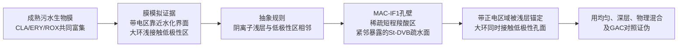

# Deep Research：ROX/大环内酯仿生吸附方案的挽救式重构

> 生成日期：2026-07-18
> 研究深度：deep（在既有30项来源审计上补充检索与反证）
> 新方案代号：`MAC-IF1`，大环内酯浅层界面仿生颗粒
> 当前状态：`conditional_lead / B0_not_passed / M0_not_passed / E1_not_ready`

## TL;DR

这条ROX路线可以挽救，但不能靠继续优化均匀MAn–St–DVB。可守住的核心创新，是把成熟污水生物膜对ROX、ERY和CLA的共同富集现象，以及大环内酯在阴离子磷脂界面的浅层取向，转译为一种**有方向、可测量、可打乱的孔壁界面**：水可接近的弱阴离子区位于疏水孔壁浅层，大环内酯的带正电区域在水化界面被锚定，较大的低极性骨架同时接触紧邻的疏水区域。

首选人工材料是毫米级多孔St–DVB颗粒，在同一批颗粒的可达孔壁上进行低覆盖度、短程PAA光接枝，形成稀疏羧酸浅层，而不是连续亲水厚膜。旧`MAC-BI1`保留为均匀分布对照。方案只有在生物界面判别、空间结构表征和同组成错配对照三步都通过后，才可以把“仿生”作为论文主创新；当前可进入的是B0/M0验证，不是完整材料实验释放。

## Executive Summary

均匀`MAC-BI1`的问题不是预期吸附能力一定差，而是其科学解释和已有材料知识没有拉开距离。多孔MAn–St–DVB球、水解羧酸型阳离子交换材料、毫米级polyDVB后接枝马来酸并水解、以及疏水保留与弱阳离子交换并用的mixed-mode材料均已有直接先例。[8–12] 如果只把羧酸和芳香骨架放入同一颗粒，即使吸附数据很好，同行仍可把它解释为普通混合模式树脂。

本轮补充证据为重构提供了一条比旧故事更强但也更窄的路径。第一，真实二级出水中的失活500 μm污水生物膜对CLA、ERY和ROX给出了非常接近的分配系数，约为10.7–10.9 L/g，并明显高于同一实验中的普萘洛尔、西酞普兰和文拉法辛；薄生物膜没有稳定复现这一优势，说明成熟生物膜的厚度、组成、孔隙或界面组织可能参与了类别富集。[1] 第二，磷脂和膜模拟实验表明，ROX能够与阴离子磷脂作用，ERY、CLA和AZI则具有共同的浅层界面取向：带正电区域靠近极性头基层，部分大环骨架进入紧邻的低极性区域。[2–6] 这些证据可以生成一个空间假说，却不能直接证明类别选择性，因为普萘洛尔等普通阳离子两亲性药物也会发生相似的膜界面分配。[7]

`MAC-IF1`因此不复制某种蛋白结合位点，也不使用蛋白、肽、抗体或天然磷脂。它提取的是一个可制造的界面规则：**在水化孔壁上设置稀疏、浅层、弱阴离子锚点，并保留紧邻且可被大环接触的低极性表面**。首选实施是低成本St–DVB毫米多孔球加一次苯甲酮/UV引发的丙烯酸浅层光接枝；AA、苯甲酮、St和DVB均是常见化学品，路线不需要昂贵纳米材料或生物试剂。[13–14] 光接枝本身不是创新，创新只能来自被直接测出的空间组织以及该组织相对同组成错配对照的功能增益。

当前方案仍有两个不能用写作掩盖的风险。其一，生物侧还没有证明500 μm生物膜的类别富集由阴离子—低极性浅界面造成；其二，低覆盖度PAA能否在毫米多孔球内部形成可重复、可达且不堵孔的浅层结构尚未证明。因此项目先释放B0生物界面判别和M0材料可制造性验证。任何一项失败，`MAC-IF1`均降级为普通mixed-mode工程材料，不再以强仿生为主线。

## 1. 需要解决的工程问题 [Confidence: High]

主场景是市政污水处理厂二沉池出水。目标不是把ROX从ERY、CLA和AZI中单独挑出来，而是共同去除这组环境上需要控制的大环内酯，同时减少DOM、无机盐和无关微污染物占用吸附位点。二级出水中的目标物通常处于痕量水平，而DOM的质量浓度和潜在吸附位点远高于目标物；只提高平衡容量不能解决有效床寿命和选择性利用率问题。

现有GAC具有成熟的固定床和真实二级出水工程基础，必须作为首要基准。[20] 弱酸树脂和mixed-mode树脂能够吸附有机阳离子，但Ca²⁺、Mg²⁺、离子强度及DOM会竞争或改变分配。[11,18] 因此本方案必须回答的不是“羧酸能否吸附ROX”，而是：

> 能否用一种由生物界面行为推导出的空间组织，使有限的阴离子位点和疏水孔面更有效地共同捕获大环内酯，并在二级出水中减少无关阳离子和DOM造成的有效容量损失？

这句话在检索生物原型之前就成立，也不会因为后续材料性能好坏而改变。

## 2. 生物原型与证据边界 [Confidence: High]

### 2.1 主场景原型：成熟污水生物膜的类别富集现象

Torresi等在1 μg/L、过滤二级出水和失活生物膜条件下研究多种微污染物的吸附与扩散。500 μm生物膜中，CLA、ERY和ROX的模型分配系数约为10.90、10.68和10.80 L/g；同条件下普萘洛尔、西酞普兰和文拉法辛明显较低。[1] 这项结果有三点价值：

1. 对象就是污水生物膜和二级出水，不需要从药理蛋白结合反推水处理；
2. 三种大环内酯出现非常接近的富集行为，符合本项目允许的类别共同去除；
3. 生物膜已经失活，结果至少排除了持续生物降解作为唯一解释。

证据也有明确边界。50–200 μm薄膜没有稳定显示同样的类别优势，研究没有用EPS去除—回补、脂质扰动或组分分级定位原因，固相量也主要通过水相损失推算。[1] 因此“成熟生物膜可以表现出大环内酯类别富集”属于事实；“这种富集由某一种EPS或磷脂界面造成”仍是待验证解释。

### 2.2 机制支持原型：大环内酯在阴离子磷脂界面的浅层取向

ROX与磷脂酰肌醇脂质体相互作用已有直接比较实验。120 μM条件下，单阳离子ERY/ROX的结合约为18%，低于双阳离子AZI和erythromycylamine；不同实验终点的细排序并不完全一致。[2] ERY和AZI更偏好阴离子PG而不是PC/PE脂质体。[3] NMR研究显示ERY、CLA和AZI在膜模拟物上的总体取向相近：带正电的胺基区域靠近水化界面，部分大环骨架进入上部低极性区域。[4] ERY的双胶束研究进一步把二甲氨基定位在磷酸基附近，把大环的一部分定位在脂肪链上部。[5] AZI的平衡透析、31P NMR和深度探针结果也主要指向头基层和浅层界面，而不是深部疏水核心。[6]

最稳妥的生物空间规则是：

> 大环内酯可在阴离子脂质界面形成浅层两亲性分配，带电区域停留在水化极性区附近，部分低极性骨架同时接触紧邻的非极性区域。

以下说法不进入本方案：ROX已有原子级取向；质子化糖基永远完全位于水相；整个大环深埋脂质核心；或者阴离子磷脂天然只选择大环内酯。

### 2.3 必须保留的反例

普萘洛尔在PS/PA负电磷脂膜上的分配系数可比在PC膜中高20倍以上，其荧光基团也被定位于极性头基层。[7] 其他带电两亲性药物同样会在磷脂囊泡发生界面吸附。这个反例决定了本论文不能把“负电＋疏水”写成大环内酯特有机制。

生物证据真正产生的新问题是：成熟生物膜为什么在同一体系下对三种大环内酯表现出接近的高分配，而薄膜和若干无关阳离子药物没有同样表现？`MAC-IF1`尝试检验其中的一个可证伪解释，即重复的浅层阴离子—低极性相邻界面是否比随机功能分布更有利于体积较大、两亲性明确的大环内酯。

## 3. 仿生对应关系 [Confidence: Medium]

| 生物证据 | 可以提取的规则 | `MAC-IF1`中的人工实现 | 预期结果 | 决定性对照 |
|---|---|---|---|---|
| 成熟失活污水生物膜共同富集CLA、ERY和ROX | 水化、多孔、重复界面可能形成类别级分配环境 | 毫米多孔颗粒中的高密度连通孔壁界面 | 在痕量条件下提高四种大环内酯的有效处理量 | 相同化学组成但均匀分布、深层分布和物理混合材料 |
| ERY/CLA/AZI在膜模拟物呈浅层两亲性取向；ROX直接与阴离子磷脂作用 | 水可接近阴离子区与低极性区需要在分子可同时接触的尺度相邻 | 疏水St–DVB孔壁上的稀疏短程PAA羧酸浅层，保留相邻暴露的低极性孔面 | 带正电区域被羧酸区稳定，同时大环接触邻近疏水面 | 总羧酸量和孔结构匹配，但羧酸分布更深或更均匀的材料 |
| 生物膜厚度改变大环内酯分配 | 界面数量、可达路径和组织方式可能比单纯官能团总量重要 | 调节孔壁覆盖度和浅层分布，而不追求酸量最大化 | 存在最佳浅层覆盖度；酸量继续增加但低极性面被遮蔽后性能下降 | 一组总酸量梯度和一组空间分布梯度，检验非单调响应 |

只有前两行的“生物特征—人工实现—测量—错配对照”全部通过，`MAC-IF1`才可归入功能仿生。若只观察到羧酸量越高吸附越多，最合理的结论是普通弱阳离子交换；若只观察到疏水性越强吸附越多，则是普通树脂分配。

## 4. 优化后的材料结构 [Confidence: Medium]

### 4.1 材料定义

`MAC-IF1`不是均匀MAn–St–DVB，也不是外表面完整包覆一层亲水PAA。其定义是：

- 颗粒形态：可筛分和装柱的毫米级多孔球，目标粒径首先在0.4–0.8 mm现有工程窗口内考察；
- 主体骨架：St–DVB或polyDVB连通多孔骨架，提供机械强度和低极性孔壁；
- 候选人工识别单元：孔壁可达区域上的**低覆盖度、短程羧酸浅层**；
- 空间要求：羧酸区面向水相，旁侧或其下仍有大环能够接触的低极性聚合物表面；
- 禁止状态：PAA形成连续厚膜并完全遮蔽疏水面、堵塞孔道，或者羧酸随机进入整个骨架而无法证明浅层分布。

### 4.2 为什么选择稀疏浅层，而不是连续功能壳

连续PAA壳容易产生三种问题：水化层把大环隔离在疏水骨架之外、羧酸量与层厚同时变化而无法判断空间作用、以及孔口堵塞造成表观动力学变化。稀疏短程接枝更接近磷脂界面中“水化头部与低极性区相邻”的物理关系，也能产生一个非平凡预测：存在最佳覆盖度，而不是接枝越多越好。

表面羧化、薄功能壳和core-shell颗粒本身已有大量先例。[12,14–17] 因此论文的新意不写“首次制备表面羧化树脂”，而写“首次检验由大环内酯生物界面取向导出的空间邻接规则是否提高二级出水中的类别有效处理量”。这一表述仍需正式专利自由实施检索，当前不能宣布绝对首次。

### 4.3 与旧MAC-BI1的关系

旧`MAC-BI1`不删除，重新定义为`UNIFORM`对照。它回答“相同的羧酸和芳香结构随机或均匀放在同一网络中能做到什么”。`MAC-IF1`只有在相近总酸量、湿态孔容、粒径和低极性水平下稳定优于`MAC-BI1`，才能证明空间组织值得保留。

## 5. 首选合成路线与可制造性边界 [Confidence: Medium]

### 5.1 首选路线：St–DVB多孔球上的短时AA光接枝

首选路线代号为`MAC-IF1-PAA`。路线分为基材和一次后处理：

1. 取得一批未离子化的毫米级多孔St–DVB球。机制验证阶段优先使用同一批商业未功能化球，避免悬浮成球波动；路线通过后再用St、DVB、常规致孔剂和悬浮聚合复现自制颗粒。
2. 颗粒清洗并保持湿态孔道开放。使用苯甲酮作为光引发剂、AA作为便宜的弱酸前体，在水/乙醇非强溶胀体系中滚动或薄层铺展颗粒，短时UV照射，使接枝优先发生在光和单体可达的浅层孔壁。
3. 充分水洗，去除游离PAA和残余单体；转为受控酸/盐形态，记录干质量、湿质量和洗液TOC。

水/乙醇中苯甲酮引发AA/MAA表面光接枝已有平面聚合物证据，PAA微粒表层也可用XPS、ToF-SIMS和化学探针定量。[13–14] 这些论文证明方法原则上可行，不证明毫米多孔球内部一定形成目标结构。因此本报告不编造一个“已优化配方”，而是把反应时间、AA浓度和苯甲酮浓度作为M0小矩阵；以实测空间分布和孔结构选择条件。

### 5.2 同一批基材产生的最小材料组

| 材料 | 制备差别 | 目的 |
|---|---|---|
| `IF1-SHALLOW` | 非强溶胀介质、低覆盖度、短时光接枝 | 候选方向性浅层界面 |
| `IF1-DEEP` | 允许基材溶胀和单体进入，调节条件使总羧酸量接近 | 同单体、同基材的空间错配对照 |
| `IF1-HIGH-COVERAGE` | 更高接枝覆盖度，但控制总干质量和孔结构 | 检验是否存在覆盖度最优值以及厚层遮蔽 |
| `PS-DVB` | 不接枝 | 低极性单功能对照 |
| `PAA-CONTROL` | 无低极性孔面的交联PAA或商业弱酸对照 | 弱酸单功能对照 |
| `UNIFORM-MAC-BI1` | 旧MAn–St–DVB整体水解 | 均匀mixed-mode对照 |
| `PHYSICAL-MIX` | PS-DVB与弱酸树脂按可达酸量配比混合 | 颗粒间组合对照 |
| 商业mixed-mode与GAC | 指定产品和粒径 | 现有技术和工程基准 |

`IF1-SHALLOW`与`IF1-DEEP`必须通过反应时间或投料调节，使可达羧酸量尽量接近。若无法同时匹配总酸量和空间分布，采用多因素模型分离酸量、孔容、表面覆盖和位置效应，不能只比较两支样品后直接归因。

### 5.3 为什么不选其他路线

- **MAn接枝—水解：**0.4–0.8 mm polyDVB、MAn后接枝、水解、3.58 mmol COOH/g和环境碱性化合物提取已有直接先例，适合作为可制造对照，不适合承担主创新。[12]
- **部分磺化：**工艺成熟，但强酸位点对盐竞争和材料机理的解释不同，浅表面磺化也有很早先例；不作为主路线。[15]
- **种子溶胀核壳：**空间控制可能更好，但通常需要两次聚合，且薄功能壳已经拥挤；只在光接枝无法得到可重复空间分布时作为备选。[16–17]
- **分子印迹：**大环内酯类别提取和ERY痕量MIP已有先例，且模板、溶剂和洗脱成本偏离本项目低成本主线。[21–22]

### 5.4 工程成本判断

St、DVB、AA、苯甲酮、水/乙醇和UV设备不涉及蛋白、抗体、肽、贵金属或二维材料。路线能否低成本放大，取决于四个实测量：每千克颗粒的UV能耗、乙醇循环回收率、接枝后合格颗粒收率、以及再生后单位体积处理成本。实验室原料便宜不等于工程成本低；最终比较单位必须是达到同一出水目标时的人民币/立方米处理水。

## 6. 三道前置验证门 [Confidence: High]

### Gate B0：生物空间规则是否值得转译

使用脂质体或支持脂质双层构建中性PC、不同阴离子PG/PI比例及不同脂肪链流动性的界面。等摩尔加入ROX、ERY、CLA、AZI，并同时加入普萘洛尔、文拉法辛、西酞普兰以及至少一种中性疏水物。通过平衡透析或超滤结合LC–MS/MS质量平衡测定分配，必要时用QCM-D、荧光深度探针或NMR合作验证界面位置。

通过条件不是“负电脂质吸附更多”，因为普通阳离子药物也可能如此。至少需要观察：

- 三至四种大环内酯呈方向一致的界面组成响应；
- 阴离子比例或界面流动性存在可重复的最佳区间，而不是只随表面负电单调增加；
- 相对匹配阳离子两亲性对照仍保留可解释的类别优势，或至少出现可由大环尺寸与浅层接触解释的不同响应曲线。

若所有阳离子药物只按电荷和logD单调分配，脂质界面不能支持类别级仿生主张，`MAC-IF1`停止或降为普通广谱阳离子吸附材料。

### Gate M0：目标空间结构是否真实存在

先做小批材料，不开展完整吸附优化。必须同时得到：

- 酸碱滴定和带电探针测得的总羧酸量与水相可达羧酸量；
- N₂吸附及湿态孔容/溶胀，确认接枝没有把孔堵死；
- 颗粒截面荧光胺标记—共聚焦剖面，观察外层到中心的功能分布；
- 外表面XPS/ToF-SIMS，以及同批平面PS伴随样的层厚和水化表征；
- 洗液TOC、残余单体和接枝层稳定性；
- `SHALLOW`、`DEEP`和`UNIFORM`之间可重复的空间差异。

共聚焦的微米级剖面不能单独证明纳米尺度邻接；XPS/ToF-SIMS又主要观察外表面。两类证据必须结合，并用水相可达探针和孔结构形成闭环。[14,23]

若只测出元素含量增加而不能证明位置，不能使用“方向性”“浅层”或“空间仿生”表述。

### Gate C0：空间顺序是否带来因果增益

在纯水缓冲体系和过滤二级出水中，使用同一批四种大环内酯和类外竞争物，比较`SHALLOW`、`DEEP`、`HIGH-COVERAGE`、`PS-DVB`、`PAA-CONTROL`、`UNIFORM`、`PHYSICAL-MIX`、商业mixed-mode和GAC。

主分析采用交互项，而不是只看最高容量。用多因素模型检验：

> 双功能浅层材料的实测表现，是否显著高于在可达酸量、湿态孔容、粒径和单功能贡献控制后所能解释的水平。

建议主要终点为痕量条件下的类别分配系数、单位可达羧酸的目标吸附量、DOM共吸附量、以及小柱`C/C0 = 0.1`时的床体积。具体倍数门槛应在盲法预实验和误差估计后预注册，不能用本报告凭空设定一个容易过线的数值。

只有`SHALLOW`在重复批次和二级出水中稳定优于`DEEP/UNIFORM`，且差异不能由酸量、孔容或外表面积解释，空间仿生因果链才通过。

## 7. 完整实验验证路线 [Confidence: High]

### 7.1 分析与质量平衡

- 四种目标：ROX、ERY、CLA、AZI；
- 阳离子两亲性反例：普萘洛尔、文拉法辛、西酞普兰，必要时加入阿替洛尔形成疏水性梯度；
- 中性/阴性边界：选择二级出水中可检出的中性疏水药物和阴离子药物；
- 所有竞争实验按等摩尔和环境相关混合浓度各做一组；
- LC–MS/MS设置同位素内标、容器空白、过滤损失、材料浸出和总质量回收；
- 至少三批独立材料、每批独立反应复孔，材料批次作为随机效应。

### 7.2 吸附机制

1. pH梯度跨越大环内酯胺基和羧酸位点的电离变化，解释静电贡献；
2. 离子强度以及Ca²⁺/Mg²⁺压力测试，解释离子交换竞争；
3. 改变孔壁覆盖度和接枝层深度，检验空间最优值；
4. 竞争动力学和小柱突破，避免平衡容量掩盖慢扩散；
5. DOM前吸附、同步加入和目标先吸附三种顺序，区分孔堵塞、位点竞争和溶液络合；
6. 用总干材料mg/g、装填床mg/mL、可达羧酸mmol/g和单位位点利用率同时报告结果。

### 7.3 二级出水和固定床

至少采集三个日期的真实二沉池出水，记录DOC、UV254、pH、电导率、主要离子、悬浮颗粒和目标背景浓度。先用过滤样确定材料本征表现，再用实际预处理条件运行小柱。比较相同空床接触时间、床高、粒径和出水目标下的：

- `C/C0 = 0.1`和`0.5`突破床体积；
- 四种目标的共同控制，而不是只展示最容易吸附的一种；
- DOM吸附量、压降、颗粒破损和反冲洗可恢复性；
- GAC及商业mixed-mode的床寿命；
- 单位处理水的材料、再生和废液处置成本。

### 7.4 再生、稳定性和安全

优先筛选低体积分数乙醇配合盐/pH调节的再生体系，避免高比例有机溶剂成为工程负担。至少进行五个完整吸附—解吸循环，记录容量、类别选择性、颗粒损失、羧酸层脱落、TOC浸出和残余单体。若再生需要高比例有机溶剂或功能层持续脱落，即使首轮吸附好看也不进入E2。

## 8. 论文故事如何成立 [Confidence: Medium]

### 8.1 Introduction的因果链

1. 二级出水中大环内酯共同去除受到DOM、盐和无关阳离子竞争，GAC和普通mixed-mode材料缺少针对有效位点利用的空间设计；
2. 成熟失活污水生物膜在真实二级出水中同时富集CLA、ERY和ROX，且表现不同于薄膜和若干无关阳离子药物；
3. 独立膜生物物理证据进一步显示多个大环内酯共享浅层两亲性取向，ROX也直接与阴离子磷脂作用；
4. 由两类证据提取的不是某个蛋白位点，而是“水化阴离子浅层与低极性区相邻、并在多孔界面中重复出现”的空间规则；
5. 本研究用低成本毫米聚合物颗粒实现并直接表征这一规则，再用同组成空间错配材料检验其是否提高大环内酯类别有效处理量；
6. 最后在真实二级出水固定床、再生和成本比较中判断该规则是否具有工程意义。

这条故事比旧MAC-BI1强，因为生物证据产生了普通材料配方不会自动产生的预测：**空间位置和覆盖度应存在最佳值，打乱位置即使保留总酸量也会损失功能**。

### 8.2 论文核心图

- Figure 1：500 μm污水生物膜类别富集现象、膜界面取向证据和人工空间规则；
- Figure 2：`SHALLOW/DEEP/UNIFORM`结构表征和可达羧酸、湿态孔结构；
- Figure 3：同组成因果对照及空间分布—类别吸附的非单调关系；
- Figure 4：分子竞争、pH、盐、Ca/Mg和DOM机制图；
- Figure 5：三个日期二级出水小柱突破、再生和GAC/mixed-mode比较；
- Figure 6：单位床体积处理量、材料稳定性和成本边界。

### 8.3 投稿层级的诚实判断

如果只得到“表面羧化后ROX容量提高”，这是一篇常规吸附材料论文，不足以让仿生成为主要创新。如果B0、M0和C0全部通过，并在真实二级出水固定床中保留空间构型优势，Introduction和机制图具备Nature Communications或Nature Water方向讨论的逻辑基础；是否达到该层级仍取决于效果幅度、跨批次稳健性、工程对照和证据完整性，而不是题目中使用“biomimetic”一词。[24–26]

## 9. 预设失败条件与替代路线 [Confidence: High]

### 9.1 立即停止强仿生主张

出现任一情况即停止：

- 脂质界面中所有阳离子两亲性药物只按电荷/logD变化，没有大环内酯共同的不同响应；
- 无法直接区分`SHALLOW`和`DEEP/UNIFORM`的空间分布；
- `SHALLOW`优势可完全由羧酸量、外表面积、孔堵塞或粒径解释；
- 等摩尔竞争或二级出水中对大环内酯没有相对DOM和无关微污染物的有效利用优势；
- 光接枝批次差异、残余单体、PAA脱落或UV能耗使工程路线失去可放大性。

### 9.2 降级但保留工程价值

若材料能够稳定共同去除大环内酯，但对无关阳离子也同样强，方案可降为广谱阳离子微污染物吸附剂，不能再称大环内酯类别识别。若均匀`MAC-BI1`或商业mixed-mode与`MAC-IF1`表现相当，则保留更简单、更便宜的工程材料，停止为仿生结构增加步骤。

### 9.3 制造备选

若AA光接枝无法形成可重复浅层，但B0证明空间规则值得转译，可转入分段悬浮/种子溶胀的可控功能壳路线。该路线工艺更复杂，必须先证明空间控制带来的性能收益足以覆盖第二次聚合和溶剂成本。MAn后接枝—水解只作为低风险对照路线，不再作为材料创新。

## 10. 当前裁决与下一步

### 10.1 裁决

- 均匀`MAC-BI1`：维持强仿生门失败，保留为`UNIFORM`基线和商业预筛机制探针；
- `MAC-IF1`：允许作为挽救后的条件性主线进入B0/M0前置验证设计；
- 实验释放：仍未达到E1，不授权直接开展完整材料合成与二级出水柱实验；
- BMDL：继续排除设计阶段使用。

### 10.2 唯一下一动作

先冻结一份`B0 + M0`最小判别包，而不是继续冻结旧商业材料预筛：

1. B0确定脂质体组成、目标物/反例、质量平衡和停止规则；
2. M0确定同一批PS–DVB基材、短时光接枝小矩阵、`SHALLOW/DEEP/UNIFORM`制备关系及空间表征；
3. 两部分都通过后，才冻结C0等组成竞争实验；
4. C0通过后，`MAC-IF1`才可进入E1机制验证就绪评审。

## Methodology

本报告是既有`DEEP_RESEARCH_ROX_STRONG_BIOMIMETIC_INNOVATION_AUDIT.md`的更新，而不是覆盖。检索采用deep深度，三条并行线分别补充ROX/大环内酯生物界面证据、低成本毫米颗粒浅层功能化路线、以及mixed-mode/表面功能层/大环内酯吸附先例的红队查新。来源以同行评议原始研究为主，专利只用于判断已有技术空间。八项高影响claim-source配对另行核验，五项SUPPORTED，三项PARTIAL并已收紧：Montenez的直接脂质体结合不再写成错误的完整排序，Torresi的10.7–10.9 L/g明确为模型外推的平衡分配系数，Dietrich的PAA层写成最高约4 nm且不把单一技术当作层厚定量。未保留UNSUPPORTED表述。

原审计把磷脂界面设为唯一主原型。本轮结构根据新证据调整为“成熟污水生物膜提供真实场景类别富集，磷脂界面提供可转译的空间机制”。调整没有把两条证据误写成已建立的因果链，二者之间的连接被明确放入B0验证门。

## Bibliography

[1] Torresi E. et al. — *Diffusion and sorption of organic micropollutants in biofilms with varying thicknesses* — Water Research, 2017 — https://doi.org/10.1016/j.watres.2017.06.027 — Tier 1
[2] Montenez J.-P. et al. — *Interactions of Macrolide Antibiotics (Erythromycin A, Roxithromycin, Erythromycylamine, and Azithromycin) with Phospholipids* — Toxicology and Applied Pharmacology, 1999 — https://doi.org/10.1006/taap.1999.8632 — Tier 1
[3] Stuhne-Sekalec L. et al. — *Liposomes as Carriers of Macrolides: Preferential Association of Erythromycin A and Azithromycin with Liposomes of Phosphatidylglycerol Containing Unsaturated Fatty Acid(s)* — Journal of Microencapsulation, 1991 — https://doi.org/10.3109/02652049109071486 — Tier 1
[4] Kosol S. et al. — *Probing the Interactions of Macrolide Antibiotics with Membrane-Mimetics by NMR Spectroscopy* — Journal of Medicinal Chemistry, 2012 — https://doi.org/10.1021/jm300647f — Tier 1
[5] Matsumori N. et al. — *Detailed Description of the Conformation and Location of Membrane-Bound Erythromycin A Using Isotropic Bicelles* — Journal of Medicinal Chemistry, 2006 — https://doi.org/10.1021/jm051210v — Tier 1
[6] Tyteca D. et al. — *The Macrolide Antibiotic Azithromycin Interacts with Lipids and Affects Membrane Organization and Fluidity* — Journal of Membrane Biology, 2003 — https://pubmed.ncbi.nlm.nih.gov/12820665/ — Tier 1
[7] Surewicz W.K., Leyko W. — *Interaction of Propranolol with Model Phospholipid Membranes* — Biochimica et Biophysica Acta, 1981 — https://doi.org/10.1016/0005-2736(81)90083-3 — Tier 1
[8] Ogawa N. et al. — *Preparation of spherical polymer beads of maleic anhydride-styrene-divinylbenzene and metal sorption of its derivatives* — Journal of Applied Polymer Science, 1984 — https://doi.org/10.1002/app.1984.070290915 — Tier 1
[9] Ogawa N. et al. — *Porous maleic anhydride-styrene-divinylbenzene copolymer beads* — Journal of Applied Polymer Science, 1987 — https://doi.org/10.1002/app.1987.070340125 — Tier 1
[10] 3M Innovative Properties — *Hydrolyzed divinylbenzene/maleic anhydride polymeric material* — WO2015095110A1, 2015 — https://patents.google.com/patent/WO2015095110A1/en — Tier 2
[11] Fontanals N. et al. — *Overview of mixed-mode ion-exchange materials in the extraction of organic compounds* — Analytica Chimica Acta, 2020 — https://doi.org/10.1016/j.aca.2020.03.053 — Tier 1
[12] Fontanals N. et al. — *Development of a maleic acid-based material to selectively solid-phase extract basic compounds from environmental samples* — Journal of Chromatography A, 2021 — https://doi.org/10.1016/j.chroma.2021.462165 — Tier 1
[13] Li G. et al. — *Surface photografting initiated by benzophenone in water and mixed solvents containing water and ethanol* — Journal of Applied Polymer Science, 2012 — https://doi.org/10.1002/app.34683 — Tier 1
[14] Dietrich P.M. et al. — *Surface Analytical Study of Poly(acrylic acid)-Grafted Microparticles* — Journal of Physical Chemistry C, 2014 — https://doi.org/10.1021/jp505519g — Tier 1
[15] Ahmed M. et al. — *Effect of porosity on sulfonation of macroporous styrene-divinylbenzene beads* — European Polymer Journal, 2004 — https://doi.org/10.1016/j.eurpolymj.2004.04.013 — Tier 1
[16] Moral A. et al. — polyDVB core with thin hypercrosslinked strong-cation-exchange shell for environmental water extraction — Sample Preparation, 2024 — https://doi.org/10.1016/j.sampre.2024.100136 — Tier 1
[17] Trullàs C. et al. — *Hypercrosslinked core-shell polymer microspheres with amphipathic and amphoteric character for the solid-phase extraction of acidic and basic pharmaceuticals from environmental waters* — Analytical and Bioanalytical Chemistry, 2026 — https://doi.org/10.1007/s00216-026-06578-z — Tier 1
[18] Bäuerlein P.S. et al. — organic cation adsorption by carboxylic cation-exchange polymers and ionic competition — Water Research, 2012 — https://doi.org/10.1016/j.watres.2012.06.048 — Tier 1
[19] Garkushina I.S. et al. — surface-carboxylated synthetic resin for erythromycin sorption — Applied Biochemistry and Microbiology, 2006 — https://doi.org/10.1134/S000368380604003X — Tier 1
[20] Böhler M. et al. — *Granular activated carbon filtration for advanced wastewater treatment* — Science of the Total Environment, 2024 — https://doi.org/10.1016/j.scitotenv.2024.175918 — Tier 1
[21] Song X. et al. — *Molecularly imprinted solid-phase extraction for simultaneous determination of ten macrolide drugs in environmental water* — Molecules, 2018 — https://doi.org/10.3390/molecules23051172 — Tier 1
[22] Xie et al. — *Molecularly imprinted polymer for erythromycin adsorption in water* — Environmental Pollution, 2023 — https://doi.org/10.1016/j.envpol.2023.122425 — Tier 1
[23] Kress J. et al. — *Site Distribution in Resin Beads as Determined by Confocal Raman Spectroscopy* — Chemistry—A European Journal, 2001 — https://doi.org/10.1002/1521-3765(20010917)7:18%3C3880::AID-CHEM3880%3E3.0.CO;2-%23 — Tier 1
[24] Harvey — *How bio-inspired is your design? A transparent reporting framework* — Communications Engineering, 2026 — https://doi.org/10.1038/s44172-026-00641-4 — Tier 1
[25] Liu et al. — synergistic binding sites for PFOA adsorption — Nature Communications, 2022 — https://www.nature.com/articles/s41467-022-29816-1 — Tier 1
[26] Nature Water — Aims & Scope — https://www.nature.com/natwater/aims — Tier 1

## Source Extracts

### 生物界面证据 [1–7]

- 成熟失活污水生物膜在真实二级出水中给出三种大环内酯的共同高分配，是本方案最接近实际场景的原型证据。
- 脂质体、胶束和双胶束研究支持多个大环内酯的浅层两亲性界面行为，ROX有直接阴离子磷脂相互作用证据，但没有ROX原子级取向。
- 普萘洛尔等反例表明相同物理机制不天然等于类别选择性，B0必须保留匹配反例。

### 材料与先例 [8–23]

- 均匀MAn–St–DVB、毫米polyDVB后接枝马来酸、mixed-mode保留、表面羧化和薄功能壳均已有直接先例。
- 水/乙醇苯甲酮光接枝和PAA表面层表征为`MAC-IF1-PAA`提供制造依据，但没有直接证明毫米多孔球内部能够形成目标浅层。
- GAC、商业mixed-mode、均匀MAC-BI1和MIP均需保留为工程或机制基准。

### 论文证据标准 [24–26]

- 强仿生主张需要透明的生物证据强度、人工对应的直接表征、可证伪预测、空间错配对照和真实场景验证。
- 期刊层级只能在实验效果、因果闭环和工程基准均完成后判断。
