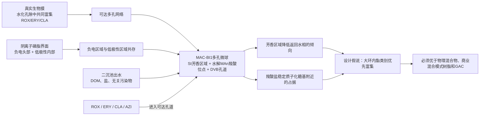

# MAC-BI1：面向大环内酯类的低成本仿生吸附颗粒

日期：2026-07-18

用途：潘尧方案审阅稿

当前状态：`concept_valid / commercial_prescreen_protocol_not_frozen / E1_not_ready`

## 1. 先给结论

这套方案目前足以说服我继续投入一个低成本、信息量很高的商业材料预筛，但还不足以说服我直接合成新微球，更不能把它写成已经成立的高性能材料。

值得继续的原因有三点：

1. 仿生起点不是ROX与某个蛋白“碰巧结合”，而是污水生物膜对多种大环内酯的真实共同富集，以及大环内酯在阴离子磷脂界面的直接分配；两类证据共同指向水化多孔结构、低极性区域和负电区域的协同。
2. 人工材料转译足够简单：用马来酸酐、苯乙烯和少量DVB形成多孔交联微球，再水解得到羧酸位点。材料中没有蛋白、抗体、多肽、二维材料、贵金属或昂贵模板。
3. 方案能够被严格推翻。商业树脂预筛、物理混合物、同体系组成梯度和GAC基准可以判断它究竟形成了有价值的类别富集，还是只是一种普通混合模式树脂。

本方案的论文目标应写成“生物多相界面启发的大环内酯类吸附颗粒”，不能写成“ROX特异识别材料”。ROX、ERY、CLA和AZI共同去除是合格结果；真正需要证明的是这组大环内酯相对DOM、盐和无关微污染物仍具有有效去除优势。

## 2. 工程问题

二沉池出水中的大环内酯浓度低，背景DOM和无机离子的浓度高。普通疏水吸附剂可能大量消耗在DOM上；普通阳离子交换材料又会受到Na、Ca、Mg及其他阳离子的竞争。只靠“更高比表面积”或“更多负电荷”不一定能在真实水中保留对目标物的有效吸附。

因此，本方案要解决的问题不是追求ROX相对其他大环内酯的狭窄选择性，而是在水化、含盐、含DOM的二沉池出水中，使一种可装柱的低成本固体对大环内酯类产生比普通疏水或普通离子交换更有效的富集。

## 3. 仿生故事

### 3.1 主生物原型：污水生物膜

受控生物膜研究在`1 μg/L`条件下观察到ERY、CLA和ROX的显著吸附。厚度约`500 μm`的生物膜中，三者模型平衡分配系数接近`10.7–10.9 L/g`；膜厚与可达孔隙显著影响分配。这说明真实的水化生物多相结构能够共同富集大环内酯，而不是只识别ROX。

从该原型转译的不是生物膜的细胞组成，而是三项功能：

- 水相能够进入的多孔网络；
- 分子进入后具有较长停留时间的低极性区域；
- 能够与带正电大环内酯发生作用的负电区域。

### 3.2 支持原型：阴离子磷脂界面

ERY、ROX和AZI能够直接与含磷脂酰肌醇的阴离子脂质体相互作用。现有证据支持两类作用同时存在：带正电糖基靠近阴离子头基，分子的低极性部分进入脂质界面。

这项证据解释了为什么材料中不能只有负电荷，也不能只有疏水孔道。仿生设计的核心是让两类作用在同一个水可达区域内共同工作。不过，人工微球不复制磷脂双层，也不声称已经获得膜一样的分子级排列。

### 3.3 没有采用的原型

- 核糖体只属于大环内酯的生物靶点，不能说明自然界用它完成污染物吸附；而且没有足够证据支持ROX特有侧链形成专属接触。
- 溶酶体酸陷获能够解释大环内酯类别富集，但开放式固体颗粒难以维持长期内部酸性，因此不转译为材料主结构。
- 蛋白、抗体和多肽即使亲和力较好，也不符合成本、稳定性和污水运行边界。

## 4. 仿生映射

| 生物现象 | 可转译原理 | MAC-BI1中的实现 | 预期功能 | 必须采用的因果验证 |
|---|---|---|---|---|
| 生物膜厚度和可达孔隙影响大环内酯分配 | 水化孔道与停留时间共同控制富集 | DVB交联的毫米级多孔微球 | 允许大环内酯进入颗粒并延长接触 | 测湿态孔容、溶胀、粒径和扩散；以无MAn的St–DVB微球作孔道对照 |
| 阴离子磷脂头部靠近质子化糖基 | 可达负电位点提供静电或离子配对稳定 | 水解马来酸酐形成羧酸/羧酸盐 | 稳定大环内酯在孔内的占据 | 酸容量与水解梯度；弱酸树脂及离子强度、Ca/Mg竞争 |
| 大环内酯低极性部分进入脂质界面 | 低极性区域降低分子返回水相的倾向 | 苯乙烯来源的芳香区域 | 提供疏水和色散保留 | 大孔非离子树脂、St–DVB空白及DOM竞争 |
| 两类区域在同一生物界面共同作用 | 空间共存可能产生超出简单相加的效果 | 羧酸与芳香结构位于同一交联网络 | 在真实水中保持类别富集 | 一体微球对比两类材料物理混合物；组成×水解双因素交互 |

只有最后一行被实验证明后，论文才能主张“仿生协同”。如果一体微球与物理混合物相同，即使吸附容量不错，也只能称为普通混合模式树脂。

## 5. 材料结构和吸附过程

候选材料由三部分构成：

- `St`：形成芳香、低极性的交联网络区域；
- `MAn`：聚合后水解为羧酸/羧酸盐，提供负电位点；
- `DVB`：维持颗粒形态、湿态孔道和固定床机械强度。

目标粒径约`0.35–1.0 mm`。现阶段只主张羧酸和芳香结构存在于同一水可达网络，不主张严格交替序列、精确位点间距或磷脂膜式有序排列。

预期过程可分成三步：

1. 大环内酯扩散进入水可达孔道；
2. 芳香低极性区域使分子不容易立即返回水相；
3. 羧酸盐与分子中质子化胺基附近区域发生静电或离子配对，进一步稳定孔内占据。

该机制不是自动成立的。普萘洛尔、文拉法辛和西酞普兰同样是疏水阳离子，而且分子更小。如果它们获得同样的吸附增强，就说明材料只偏好一般疏水阳离子，不能声称大环内酯类别优先。

## 6. 合成路线

### 6.1 已有直接制造依据

已有MAn–St–DVB多孔珠直接先例：以甘油为连续相，用羟乙基纤维素和NaCl稳定悬浮；分散相包含MAn、St、DVB、过氧化苯甲酰以及甲苯/二氧六环致孔体系。在氮气、约`70 ℃`、`200 rpm`条件下聚合`2 h`，得到约`0.35–1.0 mm`颗粒；随后使用`0.1 N NaOH`、`90 ℃`、`3 h`检验酸酐水解。

这项先例证明“悬浮成球—水解”路线在化学上可行，但不能直接视为本项目的最终SOP，因为二氧六环、湿态强度、残余单体、最终离子型态和有效羧酸位点尚未解决。

### 6.2 拟采用的两步工艺

**第一步：悬浮聚合成球**

1. 将St、MAn、少量DVB、自由基引发剂和致孔剂配成分散相；连续相使用水/甘油体系和常见悬浮稳定剂。
2. 氮气保护下升温聚合，控制搅拌形成毫米级液滴并交联固化。
3. 过滤、分级筛分，依次洗除连续相、致孔剂、未反应单体和低聚物。
4. 记录总收率、目标粒径收率、粒径分布、残余单体、干态和湿态孔结构。

**第二步：酸酐水解和离子型态调整**

1. 用稀NaOH水解可达酸酐，得到羧酸盐；设置部分水解梯度，而不是默认全部酸酐可达。
2. 充分水洗，再根据机制实验需要转换为明确的Na型、H型或部分中和型。
3. 测可达酸容量、pH滴定曲线、溶胀、湿态强度、粉化和可浸出有机碳。

### 6.3 配方开发矩阵

商业材料预筛通过后，不应只做一个配方，而应使用小型正交矩阵：

- MAn投料：低、中、高三个水平；
- DVB交联：低、中、高三个水平；
- 水解程度：部分、中等、接近完全三个水平；
- 致孔体系：先保留文献体系作为可制造参照，同时筛选更安全、可回收的替代体系。

筛选目标不是干态BET最大，而是在可达羧酸量、湿态孔道、大环内酯扩散、颗粒抗压和目标粒径收率之间取得平衡。当前不能诚实给出唯一克数配方，因为商业预筛尚未证明基础化学值得进入合成，而且直接先例中的二氧六环尚未替代。此处缺少的是经过决策门筛选的最终配方，不是缺少化学路线。

## 7. 为什么先做商业材料预筛

商业预筛用很低成本回答最危险的问题：`疏水孔道 + 羧酸位点`这组简单化学是否真的对大环内酯类有额外价值。

| 组别 | 材料 | 作用 |
|---|---|---|
| P1 | 大孔非离子树脂 | 测单独疏水孔道 |
| P2 | 弱酸阳离子交换树脂 | 测单独羧酸位点 |
| P3 | P1与P2按酸容量和质量配平的物理混合物 | 测两种普通作用简单相加 |
| P4 | 商业混合模式树脂 | 测成熟一体化材料的上限 |
| P5 | 明确型号中孔GAC | 测现实工程基准 |

ROX、ERY、CLA和AZI与普萘洛尔、文拉法辛、西酞普兰进行等摩尔竞争。若P3和P4都没有大环内酯类别偏好，继续合成具有相同基础化学的新微球缺少依据，MAC-BI1应停止。若P4存在类别偏好，才值得进一步问：能否用更便宜、组成更清楚、可制造因果对照的MAn–St–DVB微球达到或超过它。

## 8. 合成后怎样证明机制

必须至少包含以下材料：

| 编号 | 材料 | 要排除的解释 |
|---|---|---|
| T | 水解MAn–St–DVB一体微球 | 完整候选 |
| C1 | 无MAn的St–DVB多孔微球 | 单独疏水孔道 |
| C2 | 酸容量接近的弱酸树脂 | 单独负电位点 |
| C3 | C1与C2物理混合物 | 两种作用简单相加 |
| C4 | 指定中孔GAC | 工程成熟材料是否已经更好 |
| C5 | 商业混合模式树脂 | 新材料是否只是已有树脂的重复 |

在同一合成体系中还要设置MAn组成和水解程度梯度，同时测湿态孔容、溶胀、扩散、酸容量和粒径。只有“低极性保留能力×可达酸位点”出现正交互，并且T在孔结构和总电荷尽量匹配后仍优于C1、C2和C3，才能把增益归因于同一颗粒中的协同。

## 9. 性能与工程验证

### 9.1 第一阶段

- 超纯水用于机制对照，二沉池出水是主验证水样；
- 四种大环内酯共同作为目标，不要求ROX在类内最高；
- 加入三种类外疏水阳离子药物，以及中性、阴离子微污染物；
- 完成容器空白、过滤损失、进出质量回收和LC-MS/MS基质回收；
- 同时报告单位质量吸附量、分配系数、类别偏好和置信区间，不能只报去除率。

### 9.2 固定床与再生

颗粒通过批量机制门后才进入固定床。目标颗粒规格为约`0.5–1.5 mm`，初始空床接触时间可从`10–20 min`范围筛选。再生优先考察稀盐酸、NaCl和不高于`20%`乙醇的组合，不把甲醇或乙腈作为工程默认再生液。

每周期需要闭合：吸附质量、解吸质量、再生液体积、浓缩倍数、清洗水、性能恢复、材料粉化和有机物浸出。五次再生后性能低于初始值`80%`，或者质量去向无法闭合，停止扩大。

### 9.3 工程比较

不要求MAC-BI1在所有指标上都超过GAC，但至少应在相同出水目标下的材料剂量、床寿命、DOM共吸附、再生恢复率或每立方米处理成本中有一项实质优势，其他指标不能出现不可接受退化。最终评价单位是每立方米达标处理水的材料、再生和废液处置成本，而不是只比较每克材料单价。

## 10. 论文怎样成立，怎样失败

论文完整成立需要三个结果同时出现：

1. **仿生链成立：**生物膜和阴离子界面的功能能够对应到材料中可测量的孔道、低极性区域和负电位点；
2. **机制成立：**一体微球优于匹配物理混合物，增益不能由总电荷、孔容或普通疏水性解释；
3. **工程结果成立：**真实二沉池出水中，大环内酯类别去除和固定床或再生指标至少一项优于指定GAC和商业混合模式树脂。

对应的失败处置是：

- 商业预筛无类别偏好：停止MAC-BI1，不进入新微球合成；
- 新微球有效但与物理混合物相同：删除仿生协同主张，降为普通树脂研究；
- 有类别偏好但不优于商业混合模式树脂或GAC：保留机制结果，不宣称工程优势；
- 真实水、再生或粉化失败：停止放大，不能用纯水高容量替代工程验证。

## 11. 我的最终判断

这不是一套靠复杂分子识别结构取胜的方案。其优势在于故事与工程设计方向一致：真实生物多相界面能够共同富集大环内酯，人工材料用低成本交联微球检验“水化孔道、低极性区域和负电位点共存”是否可以在二沉池出水中复现这一功能。

方案最大的科学风险也很明确：MAn–St–DVB可能只是一种普通疏水—弱酸混合模式树脂，未必对大环内酯类有额外偏好。正因为这一风险能够用现成材料在合成前低成本回答，我认为它值得推进到商业材料预筛；但在预筛结果出来前，我不建议直接购买单体、优化合成或把它交接为实验就绪方案。

如果预筛通过，这套方案具有形成论文的潜力：仿生故事不依赖蛋白或牵强靶点，材料制造步骤少，对照可以拆清机制，并且最终形态能够直接进入颗粒回收和固定床验证。如果预筛失败，及时停止也能避免在一个普通树脂组合上继续包装仿生故事。

## 12. 核心证据

- [Torresi et al., Water Research, 2017](https://doi.org/10.1016/j.watres.2017.06.027)：生物膜对ERY、CLA和ROX的共同吸附及厚度效应。
- [Mingeot-Leclercq et al., Toxicology and Applied Pharmacology, 1999](https://doi.org/10.1006/taap.1999.8632)：大环内酯与阴离子磷脂界面的直接作用。
- [Sibley and Pedersen, Environmental Science & Technology, 2008](https://doi.org/10.1021/es071467d)：离子强度显著影响CLA与腐殖质结合，支持真实水竞争风险。
- [Porous maleic anhydride–styrene–divinylbenzene copolymer beads, 1987](https://doi.org/10.1002/app.1987.070340125)：MAn–St–DVB多孔珠及碱水解直接制造先例。
- [Granular activated carbon filtration for advanced wastewater treatment, 2024](https://doi.org/10.1016/j.scitotenv.2024.175918)：二级出水GAC连续处理工程基准。

本报告中的生物吸附、界面作用和颗粒制造属于已有证据；MAC-BI1的大环内酯类别偏好、界面协同、真实水性能和成本优势均属于待验证假说。
